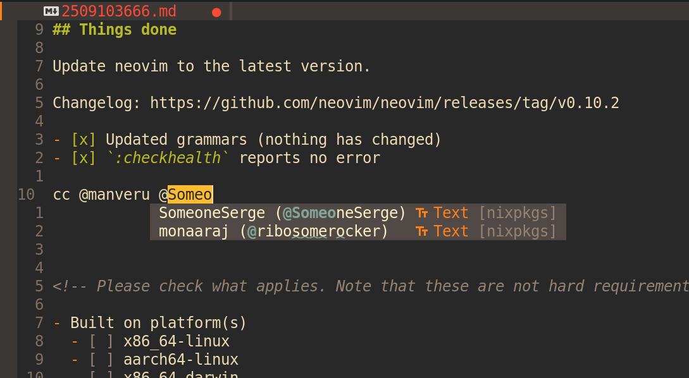

# cmp-nixpkgs-maintainers

This neovim plugin provides a [cmp](https://github.com/hrsh7th/nvim-cmp) source for completing
[nixpkgs](https://github.com/NixOS/nixpkgs/)
[maintainers](https://github.com/NixOS/nixpkgs/blob/master/maintainers/maintainer-list.nix)
when editing PR messages.

You can use the [GitHub CLI tool](https://cli.github.com/) to create your PR to nixpkgs from the
command line.
It lets you edit the PR description from your editor.
In there, you can now get completion when tagging other nixpkgs maintainers by inserting `@`.

You can either start typing the github handle or the nixpkgs maintainer alias of the person.
Each completion item is displayed `nixpkgs-handle (@GitHub-handle)`.



This plugin will fetch the `lib.maintainers` attribute from the `nixpkgs` flake and store it locally.

## Setup

```lua
require'cmp'.setup {
  sources = {
    {
        name = 'nixpkgs_maintainers',
        option = {
            -- Number of days after which the list of maintainers is refreshed
            cache_lifetime = 14,
        },
    }
  }
}
```


## Acknowlegments

- Greg Hurrell's [video](https://www.youtube.com/watch?v=gAsYolNrjtQ)
    and [implementation](https://github.com/wincent/wincent/blob/2d926177773f/aspects/nvim/files/.config/nvim/lua/wincent/cmp/handles.lua)
    of a very similar source
